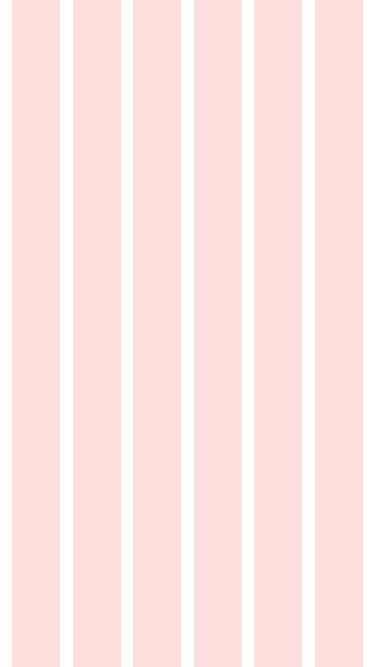
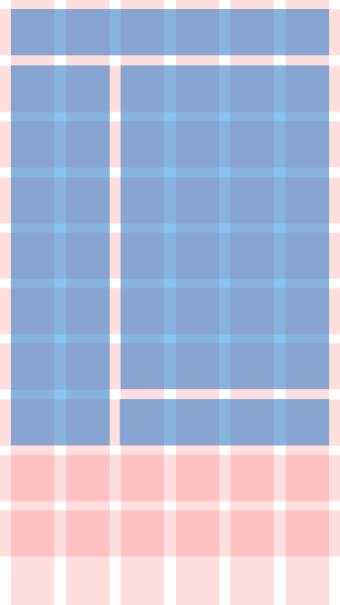
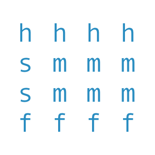
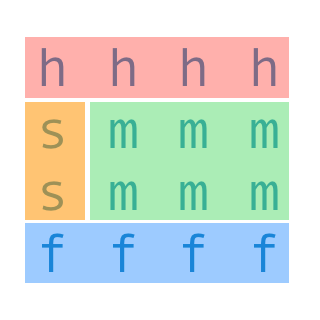
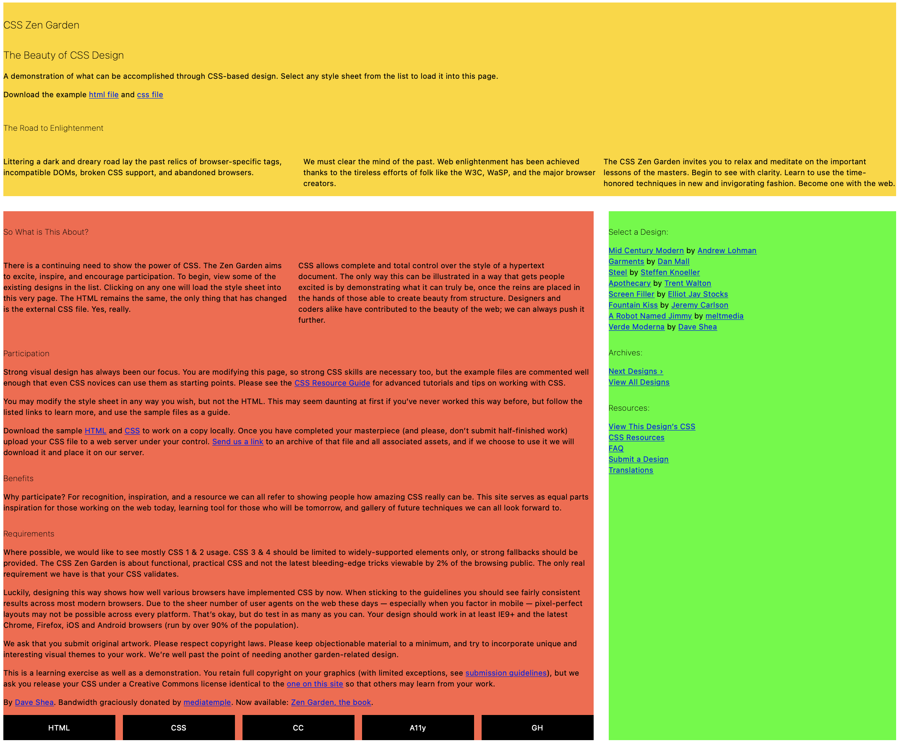
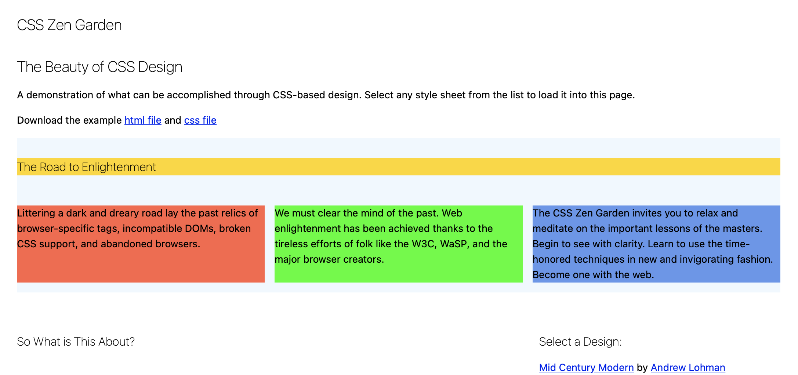

# FEW 2.2 Lesson 5 - CSS Grid

<!-- ## Review 

Imagine this is an interview question. 

Using the markup below create the button in the picture.

```HTML
<button class="next-button">Next</button>
```


Style the button using the markup above. You should only be adding CSS styles! 

The arrow image on the right side of the button should be added with the CSS background image property. Use the image below: 

<div style="background-color: black; margin: 1rem">
	
</div>

Really there is an image above but it has a white background! You should be able to click and save it to your desktop!

You'll need to do the following: 

- Give the button some padding
	- You'll need padding all sides
	- Use more padding on the right to leave room for the image
- Remove the border
- Set the font-size and color
- Set the background image with the following properties: 
	- background-image
	- background-size
	- background-position
	- background-repeat -->

## Learning Objectives 

- Use CSS Grid
- Define grid with columns and rows
- Map elements to grid cells
- Use media queries

## Video Lessons

https://www.youtube.com/playlist?list=PLoN_ejT35AEhF_M9vBuZgW0E4PiDb19oX

Watch videos: lesson 05 1-5

## What is a Grid? 

In design, a grid is used to create a system that arranges things on a page. Think of this as visually organizing your content. 

The first thing that comes to mind when you talk about a grid is graph paper. A grid in design looks a little different. A vertical grid is the space between each line and is based on the font size. Horizontally the grid is based on the column width. 

Here is a good article describing grid systems: 

https://www.oozlemedia.com/advantages-of-grid-systems-in-web-design/

## CSS Grid 

- Q: What does the CSS grid do? 
- A: CSS Grid arranges elements in rows and columns.

- Q: How is this different from Flex? 
- A: Flex is a one-dimensional arrangement. When using flex you choose an axis either horizontal or vertical. CSS grid on the other hand arranges elements on both the horizontal and vertical axis. 

- Q: Why use CSS grid over one of the CSS grid systems like Bootstrap?
- A: CSS Grid is simple enough it doesn't need an abstraction. It's more flexible and doesn't require all of the extra markup needed by a grid system like the one used in Bootstrap. 

- Q: Can you use CSS Grid and Flex together? 
- A: Yes! They both work together. You can use flex to arrange elements on a grid cell or use a grid inside an element arranged with flex. 

### Using CSS Grid

CSS Grid works similar to Flex, you set an element's display property to `grid` and all of the element's _children_ will be arranged in a grid. 

Grid is also different from Flex. A grid has two axes and allows you to define cells that make up the grid. It's more complex than Flex. 

Vocabulary

**Columns**

Columns are the horizontal divisions of the grid. Picture these as vertical bars that define the horizontal space. These are the most important measurement! 



**Gap/Gutter**

The grid gap or gutter is the space between the columns. 

**Rows**

These are the vertical divisions. Picture these as the horizontal bars that are stacked vertically. 


When you put them together you get a **grid**,


**Grid Cell**

A grid cell is a rectangular area that maps across any number of rows and columns. It has to be a rectangle! The edges must stop at the borders defined by the rows and columns. 



Generally speaking, _you can ignore the height of rows since the row height will be set by the height of the content_, though sometimes you will set this.

### Making a Grid with CSS

Imagine you have the following markup: 

```HTML
<div class="container">
	<div class="box a">One</div>
	<div class="box b">Two</div>
	<div class="box c">Three</div>
	<div class="box d">Four</div>
	<div class="box a">Five</div>
	<div class="box b">Six</div>
	<div class="box c">Seven</div>
	<div class="box d">Eight</div>
</div>
```

With this arrangement, you can use `div.container` to arrange all of the `div.box` in a grid. The following would arrange these elements into three columns with a `1em` gap. 

```CSS
.container {
	display: grid;
	grid-template-columns: 1fr 1fr 1fr;
	gap: 1em;
}
```

Let's take that apart. 

```CSS
.container {
	display: grid; /* .container arranges its children on a grid */
	...
}
```


```CSS
.container {
	...
	/* Creates three columns, which are each one fraction */
	grid-template-columns: 1fr 1fr 1fr;
	...
}
```


```CSS
.container {
	...
	gap: 1em; /* adds 1em space between columns and rows */
}
```

The `fr` is a unit that represents a fraction. A fractional unit takes up a fraction of the available space. In this each we have three fractions they should each be 1/3 or 33.333% of the space. 

If you had `1fr 1fr 1fr 1fr` each fraction would be 1/4 or 25%. 

Fraction can be any number. For example: `1fr 1fr 2fr` is a total of 4 fractions and would give us: 1/4, 1/4, and 1/2 or 25%, 25%, and 50%.

The code above is all you need for a simple grid where each cell is the same size. 

### Creating complex grids

CSS Grid provides more tools for creating more-complex grids. One of the best tools is `grid-areas`. This property allows you to define cells that span rows and columns and map elements to those cells. 

This time start with four divs. 

```HTML
<div class="container">
	<div class="box header">Header</div>
	<div class="box side">Sidebar</div>
	<div class="box main">main</div>
	<div class="box footer">Footer</div>
</div>
```

These elements represent the areas of the page and will be mapped to the grid. 

```CSS
.container {
	display: grid;
	grid-template-columns: 1fr 1fr 1fr 1fr;
	gap: 1em;
	grid-template-areas: 
		"h h h h" 
		"s m m m" 
		"s m m m"
		"f f f f"; /* Note the ; here! */
```

This time we have 4 columns each one fraction. 

The `grid-areas` property is where you will define your grid areas. The letters assign a name and the space used for a cell. 



The cells will map like this. Imagine `h` represents the header, `s` is the sidebar, `m` is the main content, and `f` is the footer. 



```
"h h h h" 
"s m m m" 
"s m m m"
"f f f f";
```

This arrangement creates four rows and four columns. Notice the syntax. You must use quotes on each line and end the last line with a semicolon. 

**Mapping Elements to Grid Areas**

Notice above that we have given each element a class name: `header`, `side`, `main`, and `footer`. Map each of these elements to one of the defined grid areas like this: 

```CSS
.header {
	grid-area: h;
}

.side {
	grid-area: s;
}

.main {
	grid-area: m;
}

.footer {
	grid-area: f;
}
```

Notice each element is assigned to a grid area by the letter assigned in the template. 

In other words `div.header` maps to the area defined by the `h`.

https://developer.mozilla.org/en-US/docs/Web/CSS/CSS_grid_layout/Grid_template_areas

## Practice with CSS Grid

Above I showed two ways to use CSS Grid. These examples work with only three properties: `grid-template-columns`, `grid-template-areas`, `grid-gap`, and `grid-area`. CSS Grid has a few more properties. 

Explore some more features of CSS Grid here: 

- https://cssgridgarden.com

## Challenge

Using the CSS Zen Garden HTML try to recreat the following grid arrangement. 


**Step 1**

The goal of step 1 is to arrange the main elements of the page into header, main and sidebar. 



Declare `.page-wrapper` as `display: grid`. All of the children of page-wrapper can now be arrrnaged on a a grid. Identify the children. 

Declare three columns each `1fr` with `grid-template-columns: 1fr 1fr 1fr`. 

Now map the children to grid cells shown with the colors with `grid-template-areas`. Something like this:

```CSS
grid-template-areas:
	"h h h"
	"m m s"
	"m M s";
```

Last, map each child elements to the grid areas defined above. 

- `.main` to `grid-area: m`
- `.intro` to `grid-area: h`
- `.sidebar` to `grid-area: s`

**Step 2**

The goal is arrange the paragraphs in the `.preamble` section in three equal columns. 



Take a look at preamble. This div has four children. You want the header at the top and the three paragraphs in columns below. 

- Declare `.preamble` `display: grid`. 
- Define three fractional columns with `grid-template-columns`
- You can use `grid-template-areas` again. The same as above. It might be good to use different letters here to be clear. 
- Formulate selectors for each of the four children of `.preamble` and assign each to a grid area. 

**Step 3**

The goal for this step is to arrange the two paragraphs here into two equal columns and have the heading span both columns. 


To do this: 

- Declare `.explanation` display grid. 
- Define template columns with two fractions
- Define template areas with two columns and two rows. 
- Map the elements to their grid areas. 

**Stretch goal**

Use media queries to change the arrangement of the grid. 

Currently your page-wrapper grid is: 

```CSS
"h h h"
"m m s"
"m m s"
```

This works well when the page is wider but when the page gets narrow this doesn't leave enough room for the sidebar. 

When the page is smaller than 800px move the grid to the bottom of the page. You can use this media query to define rules that apply in that situation. 

```CSS
@media screen and (max-width: 800px) {

}
```

In the media query redefine the grid-template-areas to something like this:

```CSS
"h h h"
"m m m"
"s s s";
```

Notice the sidebar has been moved to the bottom! 

## subgrid 
The Zen Garden page has three main sections: intro, main, and sidebar. You can use a grid to arrange these but you'd need to define another grid to arrange the children of each of these sections. For example main contains the children: explantion, participation, benefits, requirements, and footer. 

The power of grids fro design is that it gives everything a visual reference to work from. To align nested elements you'd need to define a new grid and make sure that grid used the same column structure as the parent grid. 

This probably can be more easily solved with subgrid. Subgrid inherits the grid-template-columns and grid-template-rows from the parent grid. 

CSS subgrid is a feature of CSS Grid Layout that allows a nested grid item (a grid inside a grid) to inherit the rows and columns from its parent grid, making it easier to create complex layouts that are aligned with the outer grid structure. When using subgrid, the child grid aligns its rows or columns with the parent grid, which can help maintain consistent alignment and spacing across nested elements without duplicating grid definitions. 

For example:

```css
.parent {
  display: grid;
  grid-template-columns: 1fr 2fr;
  grid-template-rows: auto;
}

.child {
  display: grid;
  grid-template-columns: subgrid; /* Inherits columns from the parent */
}
```

This lets the child grid align directly with the parent’s grid lines, making it especially useful in designs where you want inner items to follow the parent grid’s structure.

https://developer.mozilla.org/en-US/docs/Web/CSS/CSS_grid_layout/Subgrid

## Mapping grid items to columns
CSS Grid relies on the line numbers generated automatically by the grid structure, rather than custom names. Here’s an example of the same layout but using numbered lines instead of named ones.

### Using Numbered Lines

```css
.container {
  display: grid;
  grid-template-columns: 1fr 2fr;
}

.item {
  grid-column: 1 / 2; /* Positions the item from column line 1 to line 2 */
}
```

In this setup, `grid-column: 1 / 2;` positions `.item` between the first and second column lines. While this is straightforward for simple grids, it can become less readable in more complex layouts where specific sections are better referenced by name.

https://developer.mozilla.org/en-US/docs/Web/CSS/CSS_grid_layout/Grid_layout_using_line-based_placement

## Naming columns 
In CSS Grid, named columns let you assign names to grid lines, making it easier to position items within the grid. You can name grid lines in the `grid-template-columns` or `grid-template-rows` properties by placing names in square brackets. This helps you reference specific lines by name rather than by number, improving readability and maintainability.

For example:

```css
.container {
  display: grid;
  grid-template-columns: [start] 1fr [middle] 2fr [end];
}

.item {
  grid-column: start / middle; /* Positions the item from 'start' to 'middle' */
}
```

Here, the `item` spans from the `start` line to the `middle` line, making it clear where it should be positioned without relying on numeric line indexes.

https://developer.mozilla.org/en-US/docs/Web/CSS/CSS_grid_layout/Grid_layout_using_named_grid_lines

## Fitting grid items to cells
The `grid-auto-flow` property in CSS Grid controls how items are placed in the grid when there's no specific placement defined for them. It determines both the direction items flow and how they fill available spaces.

- **`row`**: This is the default value. Items are placed in rows from left to right, wrapping into new rows as needed.
- **`column`**: Items are placed in columns from top to bottom, creating new columns as needed.
- **`dense`**: Works as an add-on to `row` or `column`. With `dense`, the grid tries to fill in any gaps left by larger items, making the layout more compact by backfilling available spaces with smaller items.

### Example

```css
.container {
  display: grid;
  grid-auto-flow: row dense; /* Fills gaps in row-wise placement */
}
```

In this example, items are laid out row by row, with the grid attempting to fit smaller items into any open spaces, optimizing the grid's compactness.

Here's a simple HTML file that demonstrates `grid-auto-flow` with `row`, `column`, and `dense`. This example uses some basic CSS to show how items flow and fill in the gaps when `grid-auto-flow: row dense` is applied.

Try this example. 

```html
<!DOCTYPE html>
<html lang="en">
<head>
  <meta charset="UTF-8">
  <meta name="viewport" content="width=device-width, initial-scale=1.0">
  <title>CSS Grid Auto Flow Example</title>
  <style>
    .container {
      display: grid;
      grid-template-columns: repeat(3, 1fr);
      grid-auto-rows: 100px;
      gap: 1rem;
      margin: 2rem;
    }

    /* Toggle this line for different grid-auto-flow effects */
    /* grid-auto-flow: row;  */
    /* grid-auto-flow: column; */
    .container.row-dense {
      /* grid-auto-flow: row dense; */
      grid-auto-flow: row;
      /* grid-auto-flow: column; */
      /* When auto columns is set extra columns are generated! */
      /* grid-auto-flow: column dense; */
    }

    .container.column-dense {
      grid-template-rows: 100px 100px 100px 100px;
      grid-auto-flow: column dense;
    }

    .item {
      background-color: #4CAF50;
      color: white;
      display: flex;
      justify-content: center;
      align-items: center;
      font-size: 2em;
    }

    /* Larger items for gaps illustration */
    .item-1 { grid-row: span 2; }
    .item-4 { grid-row: span 3; }
  </style>
</head>
<body>

<h1>CSS Grid Auto Flow Example</h1>

<h2>Grid with <code>grid-auto-flow: row dense</code></h2>
<div class="container row-dense">
  <div class="item item-1">1</div>
  <div class="item">2</div>
  <div class="item">3</div>
  <div class="item item-4">4</div>
  <div class="item">5</div>
  <div class="item">6</div>
  <div class="item">7</div>
</div>

<h2>Grid with <code>grid-auto-flow: column dense</code></h2>
<div class="container column-dense">
  <div class="item item-1">1</div>
  <div class="item">2</div>
  <div class="item">3</div>
  <div class="item item-4">4</div>
  <div class="item">5</div>
  <div class="item">6</div>
  <div class="item">7</div>
</div>

</body>
</html>
```

### Explanation

- **`row dense`**: In the first example (`.row-dense`), items are placed row by row. The `dense` keyword backfills gaps created by the larger items (like 1 and 4), so smaller items can fill in those spaces.
- **`column dense`**: In the second example (`.column-dense`), items are placed in columns, filling each column top to bottom before moving to the next. The `dense` keyword again helps fill gaps when possible, optimizing space vertically.

https://developer.mozilla.org/en-US/docs/Web/CSS/grid-auto-flow


## Resources 

- [Complete Guide to CSS Grid](https://css-tricks.com/snippets/css/complete-guide-grid/)
- [CSS Grid Docs](https://developer.mozilla.org/en-US/docs/Web/CSS/CSS_Grid_Layout)
- [Grid Systems](https://www.designsystems.com/space-grids-and-layouts/)
- [CSS Grid in 5 mins](https://www.freecodecamp.org/news/learn-css-grid-in-5-minutes-f582e87b1228/)
